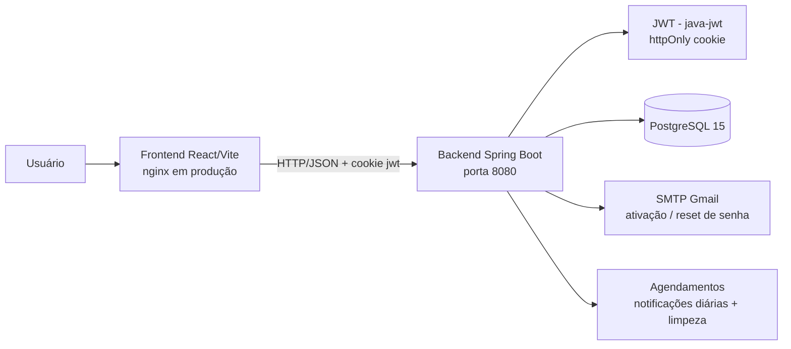
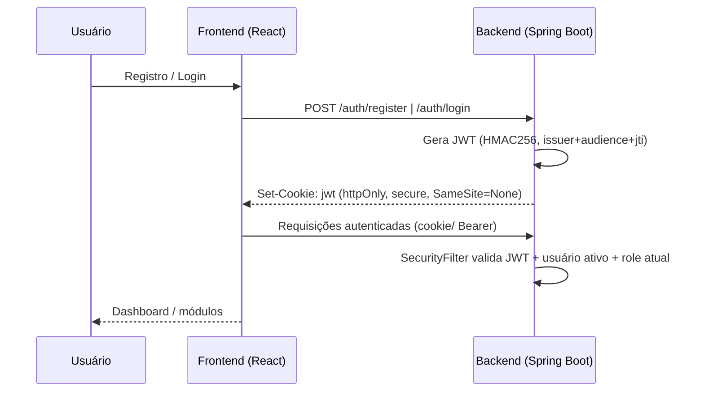
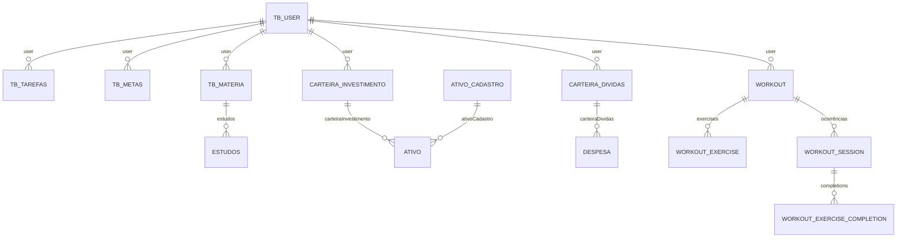

# ⚡ FocusLife Hub

Hub completo de produtividade pessoal: **tarefas, metas, matérias, estudos com cronômetro, treinos semanais e finanças com carteiras de investimento e despesas** — tudo em um monorepo com backend em Java/Spring Boot e frontend em React/TypeScript.

> Este documento descreve **exatamente** como o projeto funciona hoje: arquitetura, tecnologias, funcionalidades, modelo de dados, autenticação/segurança, execução local e deploy.

---

## 📋 Sumário

1. [Visão geral e arquitetura](#-visão-geral-e-arquitetura)
2. [Tecnologias](#-tecnologias)
3. [Funcionalidades](#-funcionalidades)
4. [Autenticação e segurança](#-autenticação-e-segurança)
5. [Modelo de dados](#-modelo-de-dados)
6. [API (endpoints)](#-api-endpoints)
7. [Como executar localmente](#-como-executar-localmente)
8. [Docker e deploy em produção](#-docker-e-deploy-em-produção)
9. [Variáveis de ambiente](#-variáveis-de-ambiente)
10. [Estrutura do projeto](#-estrutura-do-projeto)

---

## 🏗 Visão geral e arquitetura

O **FocusLife Hub** é uma aplicação **full-stack** dividida em dois pacotes dentro de um monorepo:

- **`backend/`** — API REST em **Java 17 + Spring Boot 3.5.7**, stateless, com autenticação JWT e banco **PostgreSQL**.
- **`frontend/`** — **SPA** em **React 19 + TypeScript + Vite**, consumindo a API via **Axios** e protegendo rotas no cliente.



Fluxo de autenticação típico:



---

## 🛠 Tecnologias

### Backend (`backend/`)

| Categoria | Tecnologia |
|---|---|
| Linguagem | Java 17 |
| Framework | Spring Boot 3.5.7 |
| Segurança | Spring Security + **java-jwt 4.4.0** (HMAC256) |
| Persistência | Spring Data JPA / Hibernate + **PostgreSQL 15** |
| Migrações | **Flyway** (`db/migration/V1..V18`) |
| E-mail | Spring Boot Starter Mail (SMTP Gmail) |
| Validação | Bean Validation (`spring-boot-starter-validation`) |
| Build | Maven (wrapper `mvnw`) + Lombok |
| Agendamento | `@Scheduled` (notificações diárias, limpeza de caches) |
| Container | Docker multi-stage (`eclipse-temurin:17`) |

### Frontend (`frontend/`)

| Categoria | Tecnologia |
|---|---|
| Framework | React 19 |
| Linguagem | TypeScript ~5.9 |
| Build / Dev | Vite 7 |
| Rotas | React Router DOM 7 |
| HTTP | Axios 1.x (`withCredentials`) |
| Notificações | Sonner 2.x (`toast.promise`) |
| Ícones | lucide-react |
| Decodificação JWT | jwt-decode |
| Lint | ESLint 9 + plugins hooks/refresh |
| Container | Node 22 (build) → **nginx 1.27-alpine** (runtime) |

---

## ✨ Funcionalidades

### 🔐 Autenticação e conta
- **Registro** com nome, e-mail e senha (mín. 8 caracteres) e **ativação por e-mail** (link com código válido por 24h).
- **Login** com cookie JWT `httpOnly` + `secure` + `SameSite=None`.
- **Recuperação de senha** (`forgot-password` → link por e-mail) e **redefinição** (`reset-password`, token expira em 1h).
- **Logout** que revoga o token atual na denylist e limpa o cookie.
- Edição de perfil (`PUT /users/me`): nome, e-mail e senha (troca de senha invalida todos os tokens antigos).

### ✅ Tarefas
- CRUD completo com **título, prioridade (Baixa/Média/Alta) e prazo**.
- **Status**: Pendente → Ativa → Concluída (ou Cancelada).
- Paginação, filtro por status e atalho **"Do dia"** (`GET /tarefas/do-dia`).

### 🎯 Metas
- CRUD com **título, descrição, prazo e progresso (0–100%)**.
- Barra de progresso animada com cor por faixa (🔴 <50%, 🟡 50–80%, 🟢 >80%) e filtro por status.

### 📝 Matérias + Estudos
- Cadastro de **matérias** (nome, descrição).
- Registro de **estudos** vinculados a uma matéria (data, duração em minutos, anotações).
- **Cronômetro de estudo** por matéria (`/materias/{id}/sessoes/iniciar|pausar`) com acumulação do total de horas (fonte da verdade = backend).
- Total de horas por matéria e filtro por disciplina.

### 💪 Treinos (Workouts)
- **Treinos recorrentes por dia da semana** com exercícios (séries, repetições, peso, duração, distância, anotações e ordem).
- **Ocorrências semanais** (sessões) com **checklist de execução**, status `PENDING / PARTIAL / COMPLETED` e **% de conclusão**.
- Snapshot das métricas dos exercícios na data da ocorrência (histórico imutável).
- **Navegação semanal**, resumo da semana (consistência %, execução média), **streak atual e melhor streak** e avaliação (🔥/🟢/🟡/🟠/🔴).
- **Histórico** de semanas anteriores.

### 💰 Finanças
- **Carteiras de Investimento** (`carteira_investimento`) e **Carteiras de Despesas/Dívidas** (`carteira_dividas`), com **múltiplas moedas** (BRL, USD, EUR, GBP, JPY).
- **Ativos** (tabela `ativo`): 6 categorias com formulário condicional — **Renda Fixa, Tesouro Direto, Ações, FIIs, ETFs e Criptomoedas** (preço médio × quantidade, preço atual, rentabilidade, vencimento, instituição).
- **Catálogo de ativos** (`ativo_cadastro`) com tickers e preço atual (autocomplete no cadastro).
- **Distribuição de patrimônio**: gráfico de barras horizontal por categoria com percentuais e total.
- Indicador visual de posição (🟢 acima do preço médio / 🔴 abaixo).
- **Despesas** (tabela `despesa`): contas a pagar com checklist **Pago/Pendente**, totalizadores e **log de alterações** (`GET /despesas/{id}/logs`).
- **Admin financeiro**: exclusão em massa e sincronização/atualização de preços (`/ativos/admin/**`).

### 🛡️ Administração (role ADMIN)
- **Lista de usuários**, **alteração de papel (USER ↔ ADMIN)** e **exclusão** de usuários.
- **Execução manual do job diário** de notificações (`POST /admin/jobs/daily/run`).

### 📧 Notificações por e-mail (job diário)
- `DailyNotificationJob` roda **diariamente às 08:00 (America/Cuiaba)** e envia lembretes de **contas vencendo** e **tarefas do dia** via SMTP Gmail.

### 🎨 Experiência / UX
- **Design system** próprio: `Form` (Input, Select, DateInput, NumberInput, TextArea), `UI` (PageHeader, CardGrid, Spinner, EmptyState, ProgressBar), `Modal`, `Shared`.
- **Sidebar responsiva** (fixa no desktop, drawer no mobile), notificações **Sonner** e confirmações não-bloqueantes.
- **LofiPlayer**: player de foco embutido (YouTube embed) com URL customizável salva no `localStorage`.
- Página **"Como Funciona"** que documenta cada área da plataforma.

---

## 🔐 Autenticação e segurança

O sistema é **stateless** (JWT em cookie `httpOnly` chamado `jwt`; o filtro também aceita `Authorization: Bearer <token>`). A configuração está em `config/SecurityConfig.java`.

### Política de rotas
- **Públicas** (`permitAll`): `POST /auth/login`, `POST /auth/register`, `GET /auth/activate`, `POST /auth/forgot-password`, `POST /auth/reset-password`, `POST /auth/logout`, `OPTIONS`.
- **Somente ADMIN** (`hasRole("ADMIN")`): `/admin/**` e `/ativos/admin/**`.
- **Qualquer outra rota**: exige autenticação.

### Medidas de segurança implementadas
- **JWT endurecido** (`TokenConfig`): assinatura **HMAC256**, com claims **issuer** (`FocusLifeHub`), **audience** (`focuslife-web`), **jti** (UUID), **`ver`** (tokenVersion) e expiração configurável (`jwt.expiration`, padrão 7 dias). A validação **exige issuer e audience**.
- **`SecurityFilter` valida contra o banco** em cada requisição: o usuário ainda existe, está **ativo** e o **papel (role) vem do banco** — não do token. Isso revoga tokens de usuários excluídos/desativados e impede papel estagnado (ex.: admin revogado perde acesso na hora).
- **`tokenVersion`**: ao trocar/redefinir a senha, a versão é incrementada e **todos os JWTs antigos são invalidados**.
- **Logout revoga o `jti`** em uma denylist em memória (`TokenBlacklistService`), com expiração automática junto com o token.
- **Rate limiting** (`RateLimitService`, janela de 60s por IP+ação): login (10), registro (5), forgot-password (5), reset-password (5) → HTTP `429`.
- **Anti-enumeração**: o registro retorna resposta **idêntica** (201) se o e-mail já existe, sem revelar cadastros.
- **Código de ativação expira em 24h**; token de reset expira em 1h; segredos nunca são logados.
- **CORS restrito** a origens configuradas via `CORS_ALLOWED_ORIGINS`.
- Senhas com **BCrypt** (`BCryptPasswordEncoder`).

> ⚠️ Ao mudar issuer/audience, **sessões antigas são invalidadas** (esperado em um fix de segurança). `JWT_SECRET` não tem default — a aplicação não sobe sem ele.

---

## 🗄 Modelo de dados

Tabelas gerenciadas pelo Hibernate (`ddl-auto=update`) + evoluções explícitas via **Flyway** (`backend/src/main/resources/db/migration/`).



| Entidade | Tabela | Destaques |
|---|---|---|
| `UserModel` | `tb_user` | `nome`, `email`, `password` (BCrypt), `enabled`, `activationCode` + `activationCodeExpiration`, `resetPasswordToken` + `resetPasswordTokenExpiration`, `tokenVersion`, `role` (USER/ADMIN) |
| `TarefasModel` | `tb_tarefas` | `titulo`, `status` (enum), `prioridade` (enum), `prazo` |
| `MetasModel` | `tb_metas` | `titulo`, `descricao`, `progresso` (0–100), `prazo`, `status` (enum) |
| `MateriaModel` | `tb_materia` | `nome`, `descricao`; `OneToMany` de estudos e sessões |
| `EstudosModel` | `tb-estudos` | `nome`, `duracaoMin`, `data`, `notas`, `materia` |
| `CarteiraModel` (base) | — | `id`, `nome`, `moeda`, `user` |
| `CarteiraInvestimentoModel` | `carteira_investimento` | herda base |
| `CarteiraDividasModel` | `carteira_dividas` | herda base |
| `ItemFinanceiroModel` (base) | — | `nome`, `saldo`, `dataVencimento` |
| `AtivoModel` | `ativo` | `categoriaInvestimento` (enum), `quantidade`, `valorUnitario`, `precoAtual`, `instituicao`, `dataAplicacao`, `vencimento`, `rentabilidade`, FK `ativo_cadastro_id` e `carteira_investimento_id` |
| `DespesaModel` | `despesa` | `pago` (Boolean), FK `carteira_dividas_id` |
| `AtivoCadastroModel` | `ativo_cadastro` | `id` UUID, `nome` único, `tipo` (enum), `precoAtual` |
| `WorkoutModel` | `workout` | `title`, `description`, `dayOfWeek`, `isActive`, exercícios |
| `WorkoutExerciseModel` | `workout_exercise` | `name`, `sets`, `repetitions`, `weight`, `durationMinutes`, `distanceKm`, `notes`, `sortOrder` |
| `WorkoutSessionModel` | `workout_session` | ocorrência semanal: `scheduledDate`, `status` (PENDING/PARTIAL/COMPLETED), `completionPercentage`, `completedAt`, snapshot do título |
| `WorkoutExerciseCompletionModel` | `workout_exercise_completion` | checklist da sessão com **snapshot** das métricas do exercício |

> Enums persistidos como `STRING`: `Role`, `TarefaStatus`, `Prioridade`, `MetaStatus`, `CategoriaInvestimento`, `TipoAtivoCadastro`, `SessionStatus`, `DayOfWeek`.

---

## 🔌 API (endpoints)

Base: `/api` não existe — os endpoints são diretos na raiz da aplicação. Respostas de erro padronizadas via `Exceptions/GlobalExceptionHandler` → `ErrorResponse { status, message, timestamp }`.

### Auth — `/auth`
| Método | Rota | Descrição |
|---|---|---|
| POST | `/auth/login` | Autentica e seta cookie `jwt` |
| POST | `/auth/register` | Cria conta (ativação por e-mail) |
| GET | `/auth/activate?code=` | Ativa a conta |
| POST | `/auth/forgot-password` | Envia link de reset |
| POST | `/auth/reset-password` | Redefine a senha |
| POST | `/auth/logout` | Revoga token e limpa cookie |

### Usuário — `/users`
`GET /users/me` · `PUT /users/me` (nome/e-mail/senha)

### Admin — `/admin` (ADMIN)
`GET /admin/users` · `PUT /admin/users/{id}/role` · `DELETE /admin/users/{id}` · `POST /admin/jobs/daily/run`

### Tarefas — `/tarefas`
`GET /all?page=&size=` · `GET /do-dia` · `GET /all/{id}` · `POST /create` · `PUT /alter/{id}` · `DELETE /delete/{id}`

### Metas — `/metas`
`GET /all?page=&size=` · `GET /all/{id}` · `POST /create` · `PUT /alter/{id}` · `DELETE /delete/{id}`

### Matérias — `/materias`
`GET /all?page=&size=` · `GET /all/{id}` · `POST create` · `PUT alter/{id}` · `DELETE delete/{id}` · `POST /{id}/sessoes/iniciar` · `PUT /{id}/sessoes/{sessaoId}/pausar` · `GET /{id}/tempo-total`

### Estudos — `/estudos`
`GET /all?page=&size=` · `GET /all/{id}` · `POST /create` · `PUT /alter/{id}` · `DELETE /delete/{id}`

### Carteiras
**Investimento** — `/carteiras-investimento`: `GET /all` · `GET /all/{id}` · `POST /create` · `POST /duplicar/{id}` · `PUT /alter/{id}` · `DELETE /delete/{id}`

**Dívidas** — `/carteiras-dividas`: mesmos endpoints

### Ativos — `/ativos`
`GET /all` · `GET /all/{id}` · `GET /by-carteira/{carteiraId}` · `POST /create` · `PUT /alter/{id}` · `DELETE /delete/{id}` · *(ADMIN)* `DELETE /admin/delete-all` · `POST /admin/update-prices` · `POST /admin/sync`

### Catálogo de ativos — `/ativos-cadastrados`
`GET /` (lista de tickers cadastrados)

### Despesas — `/despesas`
`GET /all` · `GET /all/{id}` · `GET /by-carteira/{carteiraId}` · `GET /{id}/logs` · `POST /create` · `PUT /alter/{id}` · `DELETE /delete/{id}`

### Treinos — `/workouts`
`GET /all` · `GET /all/{id}` · `GET /week` · `GET /history` · `POST /create` · `PUT /alter/{id}` · `DELETE /delete/{id}` · `PUT /sessions/{sessionId}/exercises/{exerciseId}` · `POST /sessions/{sessionId}/complete`

---

## 🚀 Como executar localmente

### Pré-requisitos
- **Java 17+** e **Maven** (ou usar `./mvnw`)
- **Node.js 18+** e npm
- **PostgreSQL 15** acessível

### 1) Variáveis de ambiente
Copie `env.example` para `.env` na raiz e preencha (o backend lê `../.env` de forma opcional):

```bash
cp env.example .env
```

### 2) Backend
```bash
cd backend
./mvnw spring-boot:run
```
API em `http://localhost:8080`. O Hibernate cria as tabelas e o Flyway aplica as migrações.

### 3) Frontend
```bash
cd frontend
npm install
npm run dev
```
SPA em `http://localhost:5173` (Vite). Defina `VITE_API_URL` apontando para o backend (ex.: `http://localhost:8080`).

### 4) Docker Compose (local)
```bash
docker compose up -d --build
```
Sobe `backend`, `frontend` (nginx) e `db` (Postgres 15), já com labels do Traefik.

> Scripts frontend: `npm run dev` · `npm run build` · `npm run preview` · `npm run lint`.

---

## 🐳 Docker e deploy em produção

### Imagens
- **Backend** (`backend/Dockerfile`): build multi-stage `maven:3.9.6-eclipse-temurin-17` (com `settings.xml` que força o Maven Central) → runtime `eclipse-temurin:17-jdk-jammy`, expõe **8080**.
- **Frontend** (`frontend/Dockerfile`): build `node:22-alpine` (`npm ci && npm run build`) → runtime `nginx:1.27-alpine` com `nginx.conf`, expõe **80**.

### nginx.conf (frontend)
- SPA fallback (`try_files ... /index.html`), gzip, **security headers** (`X-Frame-Options`, `X-Content-Type-Options`, `Referrer-Policy`), cache imutável de `/assets/` e bloqueio de arquivos ocultos.

### Produção (`docker-compose.prod.yml`)
- Serviços: `db` (Postgres 15, com **healthcheck** `pg_isready`), `backend` (depende do banco saudável) e `frontend`.
- Variáveis via `env_file: .env.production`.
- **Traefik** como reverse proxy: `focus.lzguimaraes.com.br` → frontend; `apifocus.lzguimaraes.com.br` → backend (rede externa `proxy`, TLS via `letsencrypt`).
- Volume persistente `focuslife_pgdata` para o banco.

### Atualizar produção (depois de um `push` na `main`)

As imagens são **construídas no servidor**: subir o código sem `build` mantém a versão antiga no ar
(foi assim que uma tela nova "não apareceu" mesmo com o código já na `main`).

```bash
cd /caminho/do/projeto
git pull
docker compose -f docker-compose.prod.yml build frontend backend
docker compose -f docker-compose.prod.yml up -d
```

Como conferir se o deploy pegou:

| Verificação | Onde | O que mostra |
|---|---|---|
| Bundle do frontend | *Como Funciona* | Seções novas (ex.: "🧩 Recuperação de Carteiras Antigas") |
| Backend | DevTools → Network → `GET /financeiro/diagnostico` | `200` (rota existe) ou `404` (backend antigo) |

---

## 🔧 Variáveis de ambiente

| Variável | Obrigatória | Descrição |
|---|---|---|
| `SPRING_DATASOURCE_URL` | ✅ | JDBC URL do PostgreSQL |
| `SPRING_DATASOURCE_USERNAME` | ✅ | Usuário do banco |
| `SPRING_DATASOURCE_PASSWORD` | ✅ | Senha do banco |
| `JWT_SECRET` | ✅ | Chave secreta HMAC do JWT (sem default) |
| `JWT_EXPIRATION_SECONDS` | ❌ | Tempo de vida do JWT em segundos (padrão `604800` = 7 dias) |
| `CORS_ALLOWED_ORIGINS` | ❌ | Origens permitidas (padrão: localhost:3000, localhost:5173, focus.lzguimaraes.com.br) |
| `SPRING_MAIL_USERNAME` | ⚠️ (para e-mails) | SMTP Gmail |
| `SPRING_MAIL_PASSWORD` | ⚠️ | App password SMTP |
| `SPRING_MAIL_FROM` | ❌ | Remetente (default = username) |
| `APP_FRONTEND_URL` | ❌ | URL pública do frontend (links dos e-mails) |
| `APP_BACKEND_URL` | ❌ | URL pública da API |
| `VITE_API_URL` | ✅ (frontend) | Base URL da API no build do frontend |

---

## 📁 Estrutura do projeto

```
FocusLife/
├── env.example                  # Template de variáveis de ambiente
├── docker-compose.yml           # Compose local (dev)
├── docker-compose.prod.yml      # Compose de produção (Traefik)
├── MAPA.md                      # Mapa técnico do monorepo
├── backend/
│   ├── Dockerfile               # Imagem Java 17 (multi-stage)
│   ├── settings.xml             # Maven restrito ao Maven Central
│   ├── pom.xml                  # Spring Boot 3.5.7
│   └── src/main/
│       ├── java/dev/LzGuimaraes/FocusLifeHub/
│       │   ├── Auth/            # AuthController, MailService
│       │   ├── User/            # UserModel, UserRepository, UserService, DTOs
│       │   ├── Tarefas/ Metas/ Materia/ Estudos/
│       │   ├── Carteira/        # Investimento e Dívidas
│       │   ├── Despesa/ Financeiro/ Ativo/ AtivoCadastro/
│       │   ├── Treino/          # Workout, sessões, execução
│       │   ├── Admin/ Email/ Exceptions/
│       │   └── config/          # SecurityConfig, TokenConfig, SecurityFilter,
│       │                        # TokenBlacklistService, RateLimitService, JWTUserData
│       └── resources/
│           ├── application.properties
│           └── db/migration/    # Flyway V1..V18
└── frontend/
    ├── Dockerfile               # Build Node 22 → nginx 1.27
    ├── nginx.conf               # SPA + security headers
    ├── package.json
    └── src/
        ├── api/api.ts           # Cliente Axios (withCredentials)
        ├── auth/                # AuthProvider, PrivateRoute
        ├── pages/               # 16 páginas (Dashboard..Admin)
        ├── components/          # Layout, Form, UI, Modal, Shared,
        │                        # LofiPlayer, EstudoTimer, Treino*, InvestInfo...
        ├── types/               # Tipos espelhando os DTOs do backend
        └── utils/               # date.ts, workout.ts
```

---

## ✅ Checklist de verificação rápida

- Backend sobe e valida JWT (sem `JWT_SECRET` ele **não** inicia).
- Flyway aplica as migrações automaticamente; `tb_user` ganhou `activation_code_expiration` e `token_version` na `V18`.
- Frontend envia cookie `jwt` automaticamente (`withCredentials: true`) — sem token no `localStorage`.
- Rotas privadas usam `<PrivateRoute>` e admin usa `<PrivateRoute requireAdmin>`.
